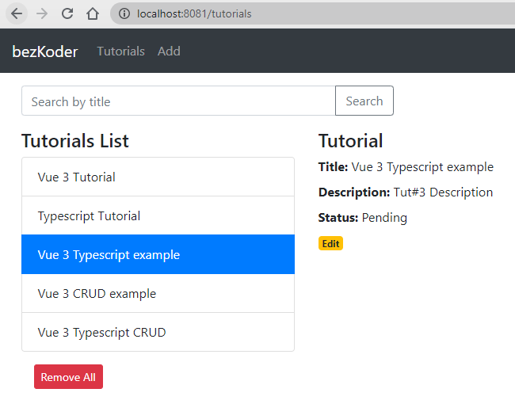

# Vue 3 Typescript example with Axios & Vue Router: Build CRUD App
Build a Vue.js 3 Typescript example to consume REST APIs, display and modify data using Axios and Vue Router.
- Each Tutorial has id, title, description, published status.
- We can create, retrieve, update, delete Tutorials.
- There is a Search bar for finding Tutorials by title.



For instruction, please visit:
> [Vue 3 Typescript example with Axios: Build CRUD App](https://bezkoder.com/vue-3-typescript-axios/)

More Practice:
> [Vue 3 CRUD example with Axios & Vue Router](https://bezkoder.com/vue-3-crud/)

> [Vue 2 CRUD App with Vue Router & Axios](https://bezkoder.com/vue-js-crud-app/)

> [Vue Pagination with Axios and API example](https://bezkoder.com/vue-pagination-axios/)

> [Vue.js JWT Authentication with Vuex and Vue Router](https://bezkoder.com/jwt-vue-vuex-authentication/)

> [Vue File Upload example using Axios](https://bezkoder.com/vue-axios-file-upload/)

Fullstack with Node.js Express:
> [Vue.js + Node.js Express + MySQL](https://bezkoder.com/vue-js-node-js-express-mysql-crud-example/)

> [Vue.js + Node.js Express + PostgreSQL](https://bezkoder.com/vue-node-express-postgresql/)

> [Vue.js + Node.js Express + MongoDB](https://bezkoder.com/vue-node-express-mongodb-mevn-crud/)

Fullstack with Spring Boot:
> [Vue.js + Spring Boot](https://bezkoder.com/spring-boot-vue-js-crud-example/)

> [Vue.js + Spring Boot + MongoDB](https://bezkoder.com/spring-boot-vue-mongodb/)

Fullstack with Django:
> [Vue.js + Django](https://bezkoder.com/django-vue-js-rest-framework/)

Integration (run back-end & front-end on same server/port)
> [Integrate Vue.js with Spring Boot](https://bezkoder.com/integrate-vue-spring-boot/)

> [Integrate Vue App with Node.js Express](https://bezkoder.com/serve-vue-app-express/)

Serverless with Firebase:
> [Vue Firebase Realtime Database: CRUD example](https://bezkoder.com/vue-firebase-realtime-database/)

> [Vue Firestore CRUD example](https://bezkoder.com/vue-firestore-crud/)

## Project setup
```
npm install
```

### Compiles and hot-reloads for development
```
npm run serve
```

### Compiles and minifies for production
```
npm run build
```

### Run your tests
```
npm run test
```

### Lints and fixes files
```
npm run lint
```

### Customize configuration
See [Configuration Reference](https://cli.vuejs.org/config/).
